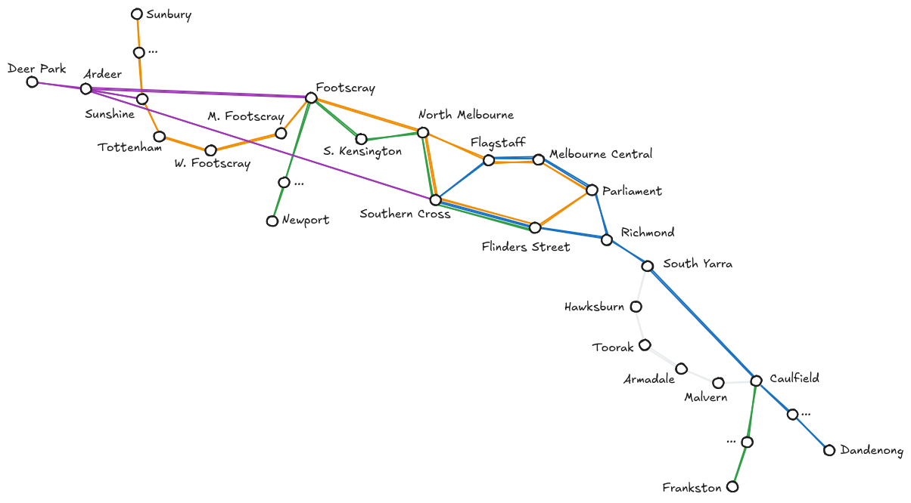
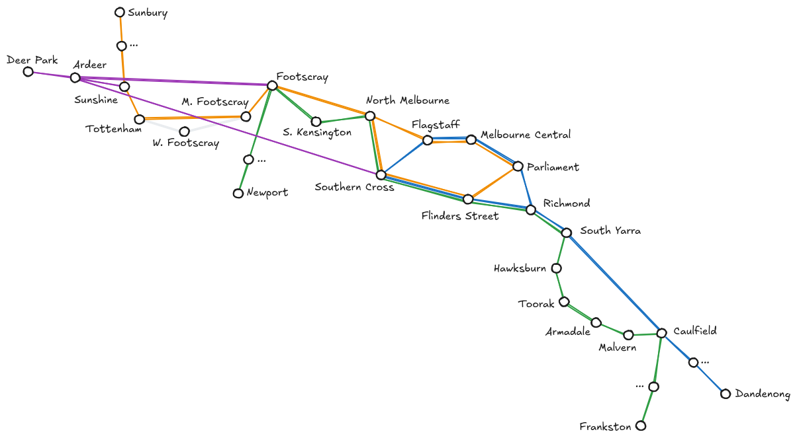
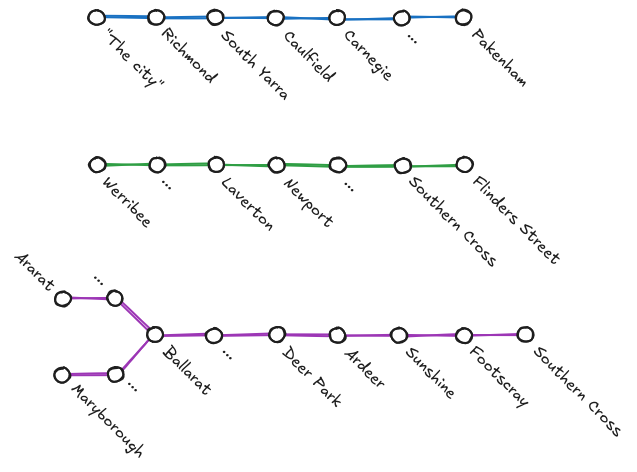
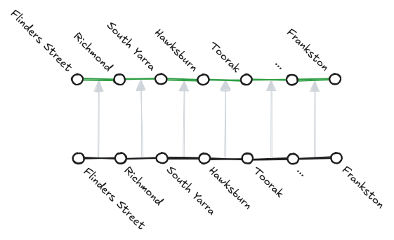
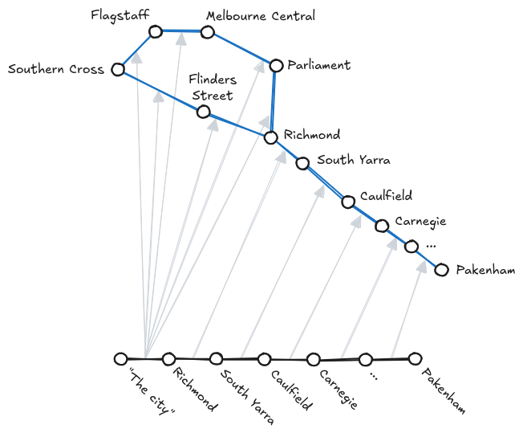
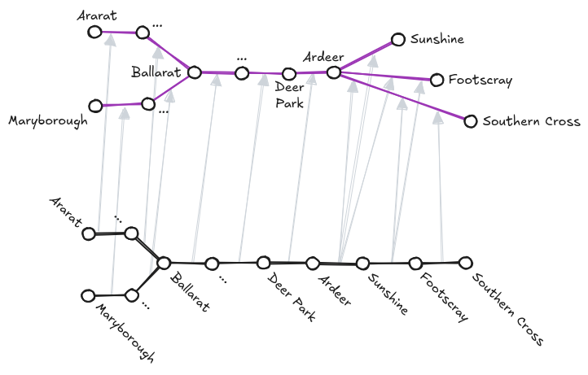

# Line Routes <!-- omit in toc -->

If you've taken a look at the `LineRoute` class (or related concepts `LineSection`, `RouteGraph`, `LineShape`, etc.) and the ways they're constructed for each line, you'll probably agree it's... quite complex.

I considered many simpler representations, and kept finding that they broke down in certain edge cases. The model I've landed on is difficult to understand at a glance, but once you do, I think you'll find it handles all sorts of edge cases quite elegantly, and also enables us to provide quite effective travel advice during any given disruption without requiring complex custom logic for each commute.

Here's how it works!

<!-- Table of contents created using "Markdown All in One" VSCode extension. -->
<!-- Command palette: "> Markdown All in One: Update Table of Contents" -->

## Contents <!-- omit in toc -->

- [The route graph](#the-route-graph)
  - [Overview](#overview)
  - [What does a disruption look like?](#what-does-a-disruption-look-like)
  - [What's the deal with regional lines?](#whats-the-deal-with-regional-lines)
  - [Things we can detect](#things-we-can-detect)
  - [What's the catch?](#whats-the-catch)
- [Line shapes](#line-shapes)
  - [Overview](#overview-1)
  - [How they're used](#how-theyre-used)
- [Conclusion](#conclusion)

## The route graph

### Overview

At any given time, the state of the transport network can be represented as a graph. Stations are nodes, and potential paths between stations are edges (those paths might be train services, buses, or even walking). If there's no way recommended way to travel between two stations directly, there won't be a direct edge between them.

In the graph's default state, all edges are train edges. Each edge has been provided by a train line.

The above image shows the route graph for a portion of the train network.

- Green edges (east/right of Flinders Street) are the Frankston line.
- Green edges (west/left of Flinders Street) are part of the Werribee line.
- Blue edges are part of the Pakenham line.
- Yellow edges are the Sunbury line.
- Purple edges are part of the Ballarat line.

While this graph looks fairly similar to the train network map, some interesting things to note:

- Where trains run express on a particular line, e.g. the Pakenham line between South Yarra and Caulfield, we draw a direct edge from South Yarra to Caulfield.
- Where multiple lines provide the same journey option, e.g. Southern Cross to Flinders Street, we draw one edge for each line.
- Regional lines look a little strange. More on that later.

We can determine that a journey is possible for any arbitrary commute by checking if the nodes for each station are connected. We can also determine which lines the passenger needs to use to achieve that commute.

### What does a disruption look like?

Each disruption adds/removes edges from the graph to reflect the new current situation.

For example, the above image shows the graph when the Frankston line is disrupted between Caulfield and the city. In this scenario, replacement buses are running between South Yarra and Caulfield to serve the stations the Pakenham line runs express through. After South Yarra, passengers must transfer back to trains in order to complete their journey into the city.

In the image above, we use light grey edges to denote buses. Note that there are **no** edges for the Frankston line between South Yarra and Flinders Street.

For another example, consider what the graph looks like when West Footscray station is closed, but trains continue to run express through the station.

This scenario provides an example of why a disruption might need to **add** edges too!

### What's the deal with regional lines?

Regional lines are a bit strange in order to account for the idea that suburban passengers cannot use regional trains for journeys which are achievable via suburban trains. This means, while the Ballarat lines stops at Deer Park, Ardeer, Sunshine, Footscray, and Southern Cross, no-one is permitted to board a citybound train from Ballarat at Sunshine.

We represent this by **not** including an edge from Sunshine to Footscray. Instead, edges to the final three "set-down only" stations are direct from Ardeer, since it's the last station where passengers can board a citybound train. (In theory, a passenger at Sunshine **could** travel backwards to Ardeer in order to take a regional train from Ardeer to the city if they really wanted to. The graph represents this perfectly!)

Apart from this strangeness inside the suburban area, regional lines look much the same as any other.

### Things we can detect

#### Buses replace trains <!-- omit in toc -->

Using the current graph with disruptions applied, does a journey remain achievable when all bus edges are removed?

#### Unusual transfer required <!-- omit in toc -->

Is the shortest path between two stations different when using the default graph compared to the current one (with disruptions applied)?

#### Reduced frequency between stations <!-- omit in toc -->

Is the number of edges on the shortest path between the two stations in question less than usual?

#### Journey not possible <!-- omit in toc -->

Lines have been known to close completely in some extreme cases, e.g. bushfire evacuations. In this case, the station you wish to travel to will be disconnected from the rest of the graph.

### What's the catch?

As flexible as the route graph is, editing it directly is a pain. If buses replace trains between Caulfield and Dandenong, I wouldn't want to require the admin to manually specify all 12 route graph edges to be removed/replaced:

- Caulfield to Carnegie
- Carnegie to Murrumbeena
- Murrumbeena to Hughesdale
- etc.

(In reality, it's actually more than 12. There's two lines implicated, the Pakenham **and** Cranbourne line, and also likely the Gippsland line too!)

Instead we should be able to enter "Caulfield to Dandenong", and the app should just be able to _figure it out_! Sounds easy, just trace the path on the route graph and list each edge along the way, right?

Unfortunately, that doesn't quite work, for two reasons:

- "X to Y" can be ambiguous on the route graph.
  - e.g. The edges on the Pakenham line indicate two possible routes from Richmond to Flagstaff. If we were to say "buses replace trains from Richmond to Flagstaff", which edges should be swapped out for bus edges?
- Regional lines... are weird!
  - Saying "buses replace Ballarat line trains from Sunshine to Southern Cross" is completely normal sentence, but impossible for the route graph to understand, since it think it has to backtrack to Ardeer.

Here we see a second concept is needed, because the superpower the route graph has for determining possible commutes becomes a massive pain for resolving simple queries like this. This second concept, I am currently calling "line shapes".

## Line shapes

### Overview

As mentioned above, "line shapes" exist to resolve a high-level phrases like "Caulfield to Dandenong" (a.k.a. line sections), into a list of relevant route graph edges automatically, so that a disruption can make use of them (i.e. remove them, convert them to bus edges, etc.).

Line shapes are represented something like this:

Wow, another graph? Well, these are a little different.

First they're _way_ simpler than the route graph. They're a tree, which means they're a graph that cannot contain cycles. That's important, because in a tree there is always **exactly one** path between nodes. To achieve that, you'll notice certain details have been simplified. For example, the entire City Loop on the Pakenham has been replaced by one node called "The city", and both paths between Newport and Laverton have been collapsed down to a single edge.

This has some interesting implications. It means instead of "Caulfield to Flinders Street" for the Pakenham line, we will use "Caufield to the city" and it will include the City Loop too. It also means a disruption between "Laverton and Newport" on the Werribee line will include both paths. This simplification is necessary to avoid ambiguity, and will work in 99% of cases. For any other cases, we can always fall back to editing the route graph manually of course!

Second, there's one graph per line, not one graph for the whole network. That means any phrase like "Flinders Street to Caulfield" is meaningless without a line to apply it to. It can also be interpreted differently depending on the line, e.g. while "Flinders Street to Caulfield" is invalid for the Pakenham line (because we have "The city" instead of Flinders Street), it's perfectly fine for the Frankston line (which doesn't use the City Loop).

Third, these graphs aren't for route finding, and therefore don't need to follow the route graph rules. As the example above shows, regional lines can be drawn just like any other line, we don't need to treat set-down-only stations as anything special.

### How they're used

So, how do line shapes help translate "Caulfield to Dandenong" to a list of route graph edges?

Well, as you've no doubt guessed, Caulfield and Dandenong need to be two nodes on the line shape. That means for the Pakenham line, the phrase can include "The city" (since it's a node) but can't include any of the CBD stations directly (i.e. "Flinders Street to Caulfield" doesn't work, as previously mentioned). Since it's a tree, there's guaranteed to be exactly one unambiguous path between those nodes, so we note down which edges in the line shape form that path.

Then, each edge is mapped to one or more route graph edges that are relevant for that edge. Essentially, each line shape edge stores an array of route graph edges that would need to be removed if that section of line was disrupted. In the simplest case, it's just a 1-to-1 mapping, e.g. for the Frankston line:

But of course, many route graph edges can be collapsed into one line shape edge or line shape node, so it's not always that simple. Here's the Pakenham line, with the City Loop:

All route edges in the CBD section after Richmond are all mapped to the line shape edge between "The city" and Richmond.

And now the Ballarat line, with it's set-down-only stops after Ardeer:

Notice how the line shape edge from Sunshine to Footscray knocks out both Ardeer to Footscray and Ardeer to Southern Cross? It assumes if Sunshine to Footscray is down, there'll be no way to use the Ballarat line to get to Southern Cross either.

Anyway, since we've got our list of line shape edges, and we know which route graph edges each one maps to, we now have our total list of route graph edges!

That's the process! 😅

## Conclusion

To summarise, the difference between these two concepts is:

- The route graph is helpful for determining if a commute between **any two stations** is impacted by a disruption, and how.
- Line shapes are helpful for translating a phrase like "Caulfield to Dandenong" into an **unambiguous** list of relevant route graph edges. They are only ever used in the context of **one particular line**.

Note that if you're curious to see the full unabridged list of route graph edges sorted by line, as well as the line shape of each line, you can do so! There's a snapshot test to test that these graphs are being built correctly, and [its output](/tests/server/data/static/line-routes/__snapshots__/line-routes.test.ts.snap) shows everything.
