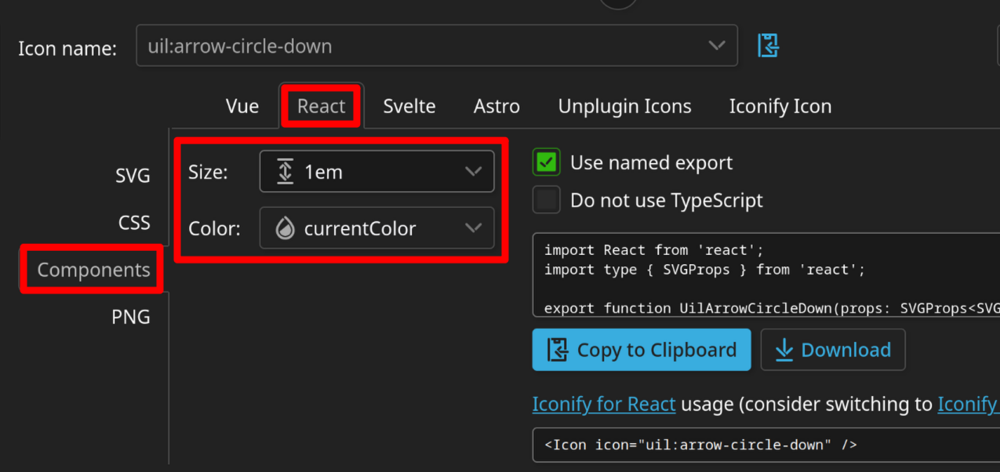

# UI Conventions <!-- omit in toc -->

Some notes on what I think is a good strategy for UI and how the core components are intended to be used.

<!-- Table of contents created using "Markdown All in One" VSCode extension. -->
<!-- Command palette: "> Markdown All in One: Update Table of Contents" -->

## Contents <!-- omit in toc -->

- [Philosophy](#philosophy)
- [Core Component Usage](#core-component-usage)
  - [`<Text>`](#text)
  - [`<Column>` and `<Row>`](#column-and-row)
  - [`<Grid>`](#grid)
  - [`<Spacer>`](#spacer)
  - [`<With>`](#with)
  - [`<Button>`](#button)
  - [`<Link>`](#link)
- [Icons](#icons)
  - [Adding new icons](#adding-new-icons)

## Philosophy

First, we're using [Tailwind](https://tailwindcss.com/), which comes with a philosophy of it's own:

- Elements are styled by setting `className` with utility classes, e.g. `px-2`, `text-xl`.

  - **Benefit:** The styles are right there in the JSX.

- You never use cascading, i.e. you style the element at hand, not its child elements.

  - **Benefit:** Never have to go looking to find where a style is set, it's always on the element itself.

- Many HTML tags are unstyled, e.g. `<button>` and `<a>`, `<h1>`, `<h2>`, etc.

  - **Benefit:** The visual style and HTML behaviour are decoupled. You can reuse the same styles to make a button using `onClick`, or a link that needs to look like a button using `href`.

On top of this, I think there's a few additional rules we can follow to make UI development easier.

- Prefer `display: flex/grid` to `display: block` (which is the default for `<div>`).

  - **Benefit:** `display: block` collapses vertical margins, and doesn't support `gap`, alignment, or growing to fill space.

  - Anytime you're reaching for a `<div>`, instead consider `<Column>` (a flex column).

- Avoid margins if at all possible. Prefer setting padding and gap in the parent element, or using spacers.

  - **Benefit:** Padding and gap are the end goal, i.e. you say "I'll add some margin so there's a gap between these elements", not "ah geez, I really want the 0.5rem to the right of each element in this row to be empty except the last one".

  - **Benefit:** No need to have a `margin`/`className` prop in every component.

  - If the gap size is not always even, `<Spacer>` can be used to manually define the space between elements.

- Prefer discrete styles over full flexibility.

  - **Benefit:** Makes it harder to accidentally create an inconsistent design, and easier to make a site-wide tweak.

  - An example is the `<Text>` component, which tries to get you to pick a style from a predefined list, rather than letting you choose your own font weight, size, color, etc.

  - Most components we write should not expose `className` as a prop.

## Core Component Usage

### `<Text>`

Renders text.

#### Examples <!-- omit in toc -->

```tsx
<Text style="title" align="center">
  Some text, where <b>this bit</b> is bold.
</Text>
```

```tsx
<Text style="custom" className="text-sm text-green-800">
  Some text, where <b>this bit</b> is bold.
</Text>
```

#### Rules of `<Text>` <!-- omit in toc -->

- Do not nest `<Text>` elements.

  - **Reasoning:** `<Text>` has some internal magic to more accurately measure line height, achieved by having some `display: block` pseudo-elements. So it won't behave correctly inside a paragraph.

  - The only child elements of `<Text>` should be `<Link>`, `<b>`, `<strong>`, `<i>`, `<em>`, and `<span>`.

- Never use `className` for margin/padding on `<Text>`.

  - **Reasoning:** The `oneLine` mode uses padding (which is cancelled out using a pseudo-element) to ensure text outside the bounding box (like lowercase j, g, p, etc.) aren't cut off.

  - If you must set margin/padding, use `<With>` instead.

### `<Column>` and `<Row>`

Arranges items in a CSS Flexbox column or row.

#### Examples <!-- omit in toc -->

```tsx
<Column align="center">
  <Text>Thing 1</Text>
  <Text>Thing 2</Text>
  <Text>Thing 3</Text>
</Column>
```

```tsx
<Row className="gap-4 px-2">
  <Text>Thing 1</Text>
  <With flexGrow="1">
    <Text>Thing 2</Text>
  </With>
  <Text>Thing 3</Text>
</Row>
```

#### Rules of `<Column>` and `<Row>` <!-- omit in toc -->

- Don't abuse `className` for complex layouts, e.g. media queries.

  - **Reasoning:** Those are best implemented as custom components.

  - It's exposed for things like padding, gap, background color, border, and drop shadows.

### `<Grid>`

Arranges items in a CSS Grid.

#### Examples <!-- omit in toc -->

```tsx
<Grid columns="1fr auto">
  <Text>Thing 1</Text>
  <Text>Thing 2</Text>
  <With gridColumn="2" gridRow="2">
    <Text>Thing 3</Text>
  </With>
</Grid>
```

```tsx
<Grid columns="1fr 3fr" rows="3rem 1fr" areas="nav nav, l-sidebar body">
  <With gridArea="nav">
    <Navbar />
  </With>
  <With gridArea="l-sidebar">
    <Sidebar />
  </With>
  <With gridArea="body">
    <Text>Precious content</Text>
  </With>
</Grid>
```

#### Rules of `<Grid>` <!-- omit in toc -->

- Don't abuse `className` for complex layouts, e.g. media queries.

  - **Reasoning:** Those are best implemented as custom components.

  - It's exposed for things like padding, gap, background color, border, and drop shadows.

### `<Spacer>`

An invisible gap.

#### Examples <!-- omit in toc -->

```tsx
<Column>
  <Text>Thing 1</Text>
  <Spacer h="4">
  <Text>Thing 2</Text>
  <Text>Thing 3</Text>
</Column>
```

#### Notes <!-- omit in toc -->

- Units are in the Tailwind spacing scale, i.e. `4 = 1rem`.

#### Rules of `<Spacer>` <!-- omit in toc -->

- Consider using padding or gap in the parent container if possible.

  - **Reasoning:** See "Philosophy" above.

### `<With>`

Applies additional layout props to the inner element.

#### Examples <!-- omit in toc -->

```tsx
<Grid columns="1fr auto">
  <Text>Thing 1</Text>
  <Text>Thing 2</Text>
  <With gridColumn="2" gridRow="2">
    <Text>Thing 3</Text>
  </With>
</Grid>
```

#### Rules of `<With>` <!-- omit in toc -->

- Great for setting flex grow, or grid columns/row/area.

  - **Reasoning:** Child components shouldn't be concerned with how their parent chooses to layout them out. Using `<With>` lets us get away without needing to put these props on every component we write.

- This is a last resort for setting margin. Consider alternatives.

  - **Reasoning:** See "Philosophy" above in regards to margin. `<With>` also wraps the element you pass it in another `<div>` increasing the size of the DOM tree.

### `<Button>`

A clickable element (supports `onClick` or `href`).

#### Examples <!-- omit in toc -->

```tsx
<Button onClick={() => console.log("Hello.")}>
  <Column className="bg-soft group-hover:bg-soft-hover group-active:bg-soft-active">
    <Text>Hello.</Text>
  </Column>
</Button>
```

#### Rules of `<Button>` <!-- omit in toc -->

- Are you sure you don't want `<SimpleButton>`?

  - **Reasoning:** `<Button>` is the low-level component that makes a clickable div. `<SimpleButton>` is the component which takes an icon and/or text and creates a basic button.

- Child elements should use `group-hover` and `group-active` for styling, over `hover` and `active`.

  - **Reasoning:** While the two should be equivalent, ideally your styling is controlled by whether the `<button>`/`<a>` tag inside `<Button>` is hovered, not whether the content within is.

### `<Link>`

Clickable inline underlined text.

#### Examples <!-- omit in toc -->

```tsx
<Text>
  Some text with a <Link href="https://isitbuses.com/">link</Link>.
</Text>
```

#### Rules of `<Link>` <!-- omit in toc -->

- Use inside a `<Text>` element.

  - **Reasoning:** The text component has some magic to more accurately measure line height.

- `<Button>` supports `href`, so only use this if you want the underlined text.

  - **Reasoning:** You'd just be working against the built-in styling of this component otherwise!

## Icons

All icons can be found under `/components/icons`, and the code for an icon component looks something like [this](/components/icons/RiAddCircleLine.tsx).

Since they're just `<svg>` elements set to a size of `1em` and using `currentColor`, you can style them as you would with text, i.e.:

- To set the color, use `text-[color]`, e.g. `text-white`.

- To set the size, use `text-[size]`, e.g. `text-2xl`.

See [this code](https://github.com/dan-schel/train-disruptions/blob/af77e069485c72c0db283480acdf24f056c46f85/components/common/SimpleButton.tsx#L34) for an example of this in action.

### Adding new icons

For new icons, a great place to find them is [Iconify](https://icon-sets.iconify.design/). For consistency, obviously it'd be great if we could stick to the same icon set for every icon, but that might not be feasible in practice.

Once you've chosen your icon in Iconify, to generate the icon component code, choose the following settings:

- On the left, choose "Components".

- On the top, choose "React".

- For size, choose "1em".

- You can then either download the file or copy to clipboard and paste.

  - If you copy/paste, please be sure to name the file the same name as Iconify has, in `PascalCase`, e.g. `uil:arrow-circle-down` becomes `UilArrowCircleDown.tsx`.


